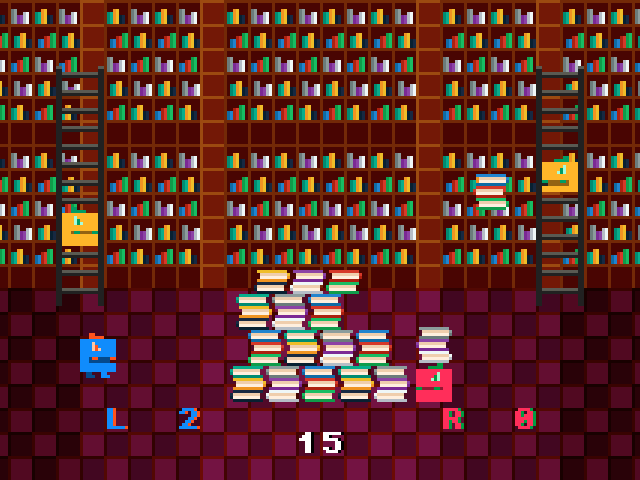
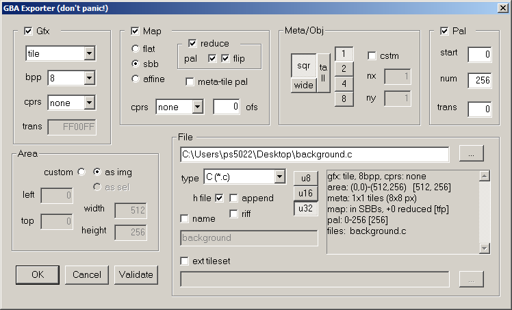
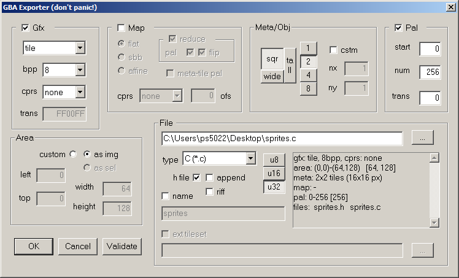

# LvR



A two-player minigame compilation for the Game Boy Advance, developed using the
[Tonc](https://www.coranac.com/tonc/text/) GBA development library.

---

## Concept

LvR is a same-console two-player game. Both players hold the **same GBA** — player 1
grips the left side and uses the **L button**, while player 2 grips the right side and
uses the **R button**. No link cable required.

---

## Minigames

### 1. Fruit Falls
Fruit drops from trees at the top of the screen. Players run back and forth to catch
it. Whoever catches the most fruit in 30 seconds wins. Hold L/R to advance toward the
center; release to retreat toward your edge.

### 2. Sleep Sneak
A sleeping character patrols the street. Players must tiptoe past without waking them
up. Mash your button to tiptoe forward — but if the sleeper stirs and catches you,
you get pushed back. First player to reach the end of the street wins.

### 3. Jewel Jaunt
Players rappel down into a vault on ropes and snatch gems as they pass. Hold your
button to climb; release to descend. Whoever steals the most jewels wins.

### 4. Raft Rumble
Both players share a raft on the water. Mash your button to shove your opponent
toward the edge. Whoever gets knocked off the raft loses the round.

### 5. Tome Tosser
Players assist librarians in shelving books. Hold your button to back up and create
throwing distance; release to toss a book to your librarian. Whoever passes off the
most books in 30 seconds wins.

---

## Game Modes

### Level Select
Choose any of the five minigames to play as a one-off match.

### Tournament
Play a randomized best-of-five series across all five minigames. The game tracks
scores across rounds and announces the overall winner once one player reaches 3 wins.
Match order is randomized from a preset table each tournament.

---

## Controls

| Input | Action |
|-------|--------|
| **L** | Player 1 action |
| **R** | Player 2 action |
| **START** | Confirm selection |
| **L / R** (menus) | Navigate left/right |

Both players navigate menus together — L moves the cursor left, R moves it right,
and START confirms. In-game controls vary by minigame but always use only L and R.

---

## Building

This project uses [devkitARM](https://devkitpro.org/) and the
[Tonc](https://www.coranac.com/tonc/text/) GBA library.

### Prerequisites

- devkitARM (part of devkitPro)
- Tonc library (`tonclib`)
- `TONCCODE` environment variable pointing to your Tonc installation, or Tonc placed
  two directories above the project root

### Build
```bash
make
```

This produces `LvR.gba`, which can be run in any GBA emulator or flashed to a
cartridge.

### Clean
```bash
make clean
```

---

## Project Structure
```
LvR/
├── LvR.c          # All game source code
└── Makefile       # Build configuration
```

All game logic, graphics data, palette data, and map data are contained in a single
source file. Graphics assets are embedded directly as compile-time constant arrays in
GBA tile/palette format.

---

## Technical Notes

These may be useful if you're using this as a reference for your own GBA project.

### Graphics

- **Mode 0** is used (tiled background mode), with two background layers active: BG1
  for level backgrounds and BG0 for the text/HUD layer.
- Backgrounds use **8bpp tiled graphics** with 64×32 screemblocks for wide levels.
- Sprites (OBJs) use **8bpp, 1D mapping** with a 128-entry OAM buffer that is copied
  to OAM each frame via `oam_copy`.
- All tile data, palette data, and tilemaps are stored as `const unsigned int` arrays
  aligned to 4 bytes and loaded into VRAM at runtime with `tonccpy`.
- An affine object group (ID 40) is used to flip sprites horizontally — this is the
  technique used in place of a dedicated horizontal-flip identity matrix since Tonc's
  `ATTR1_SIZE_16/64` and `ATTR1_AFF_ID` flags are mutually exclusive on OBJ attr1.

### OAM / Sprites

- The game uses a software OAM buffer (`oamBuffer[128]`) that is written each frame
  and then bulk-copied to OAM during VBlank with `oam_copy`.
- Sprites are hidden by ORing `ATTR0_HIDE` into attr0.
- Animation frames are stored in a spritesheet layout; frame offsets are tracked via
  `startFrame` and `cursorFrame` fields on each game object struct.

### Converting Backgrounds / Sprites to Byte Arrays

- This project uses [Usenti](https://www.coranac.com/projects/usenti/) to convert bitmap
  image files (see the BMP files in the `img` folder of the repository) into byte arrays.
- Usenti settings for converting background images:
  
- Usenti settings for converting sprite images:
  

### Text / HUD

- Text rendering uses Tonc's `se_puts` / `se_clrs` tilemap text system (`txt_init_se`).
- Multiple font color schemes are pre-initialized (blue/orange for player 1, red/green
  for player 2, white/black for timers, etc.) and referenced by constant IDs.
- `se_clrs` is called before `se_puts` to erase the previous string before writing
  a new one at the same position — there is no full HUD redraw each frame.

### Scrolling / Level Transitions

- Each level starts with a horizontal scroll-in: `REG_BG1HOFS` is incremented each
  frame from 0 to 256, revealing the level from the right. Gameplay and the
  intro jingle are gated behind this scroll completing.
- `screenX` tracks the current scroll offset and is used as a gate for enabling
  player input (`keyEnable`).

### Audio

- Only GBA Channel 1 (square wave with sweep) is used.
- Sound effects are one-shot frequency writes via `REG_SND1FREQ = SFREQ_RESET | SND_RATE(note, octave)`.
- A short 4-note jingle plays at the start and end of each round using a
  decremented timer (`startJingleTimer` / `endJingleTimer`).

### Randomness

- A simple LCG-style PRNG is used: Tonc's `sqran` / `qran` seeded by an incrementing
  `seed` value combined with the current frame count, called via the `getRan` helper.

### Game Loop

- VBlank-synchronized via `VBlankIntrWait()` called at the top of each main loop
  iteration.
- Each minigame is a self-contained function that returns an integer representing the
  next screen to load (0 = title screen, 1–5 = minigame levels).
- The top-level `main` loop dispatches to the appropriate function based on this
  return value.

---

## License

Released under the MIT License as a reference/learning resource. Feel free to read, adapt,
or build upon this code for your own GBA projects.
